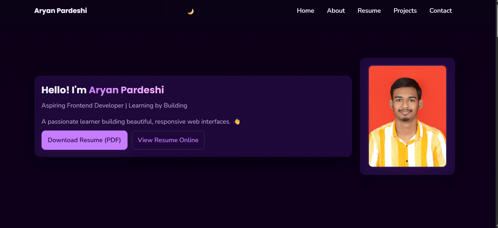

## 🧾 **Complete `README.md` for Your Personal Portfolio**

````markdown
# 💼 Personal Portfolio Website

A modern, responsive, and visually appealing personal portfolio website to showcase my **skills, projects, and resume**.  
Designed with a focus on interactivity and a clean user experience.

---

## 🚀 Live Demo
<a href="https://aryan2712sp.github.io/Personal_Portfolio/" target="_blank">
  
</a>

---

## 🖼️ Preview


---

## ✨ Features
- 📱 Fully responsive design for all devices  
- ⚡ Fast and lightweight frontend  
- 🎨 Interactive UI built with HTML, CSS & JS  
- 🧩 Includes sections for About, Skills, Projects, and Contact  
- 📄 Downloadable resume integration  

---

## 🛠️ Tech Stack
- **HTML5** — structure and layout  
- **CSS3** — custom styling and animations  
- **JavaScript (ES6)** — interactivity and DOM manipulation  
- **GitHub Pages** — free live deployment  

---

## 🧩 Setup & Run Locally

To view this project locally on your machine:

```bash
# Clone this repository
git clone https://github.com/aryan2712sp/Personal_Portfolio.git

# Navigate to the project folder
cd Personal_Portfolio

# Open with Live Server (VS Code)
# or simply double-click on index.html
````

Then open:

```
http://127.0.0.1:5500/
```

or your live server URL.

---

## 📫 Contact

If you'd like to connect or collaborate, feel free to reach out!

* **Name:** Aryan Pardeshi
* **GitHub:** [@aryan2712sp](https://github.com/aryan2712sp)
* **Email:** *[aryansp2712@gmail.com]*
* **LinkedIn:** *[https://www.linkedin.com/in/aryan-pardeshi-370336342/]*

---
